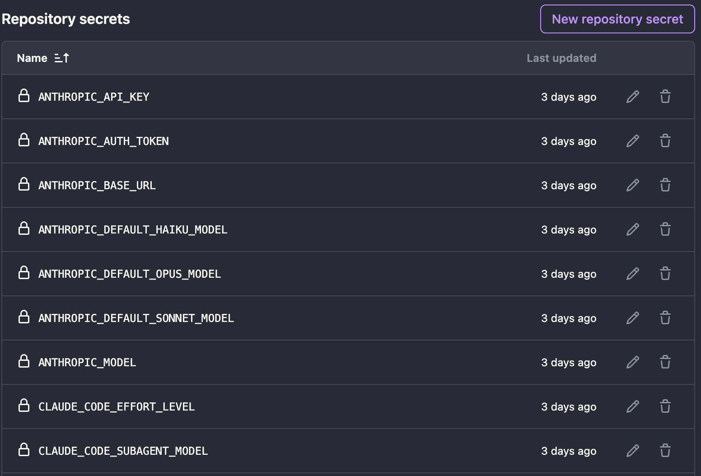
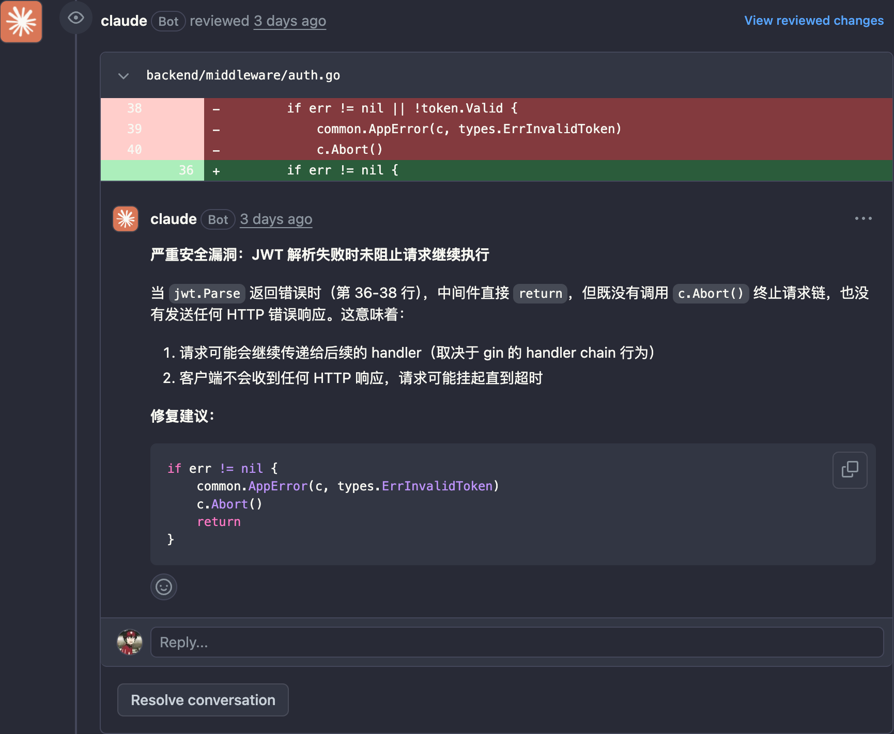
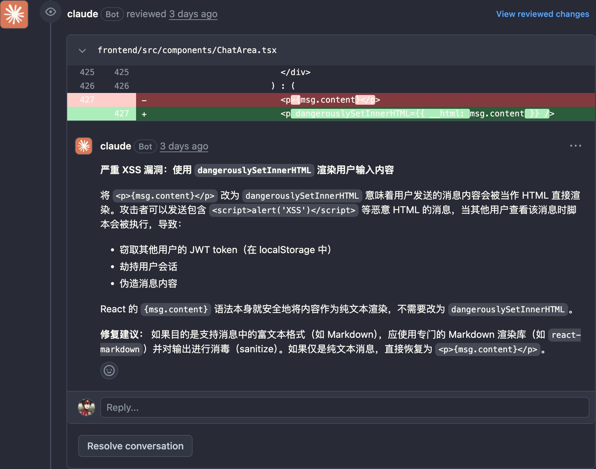
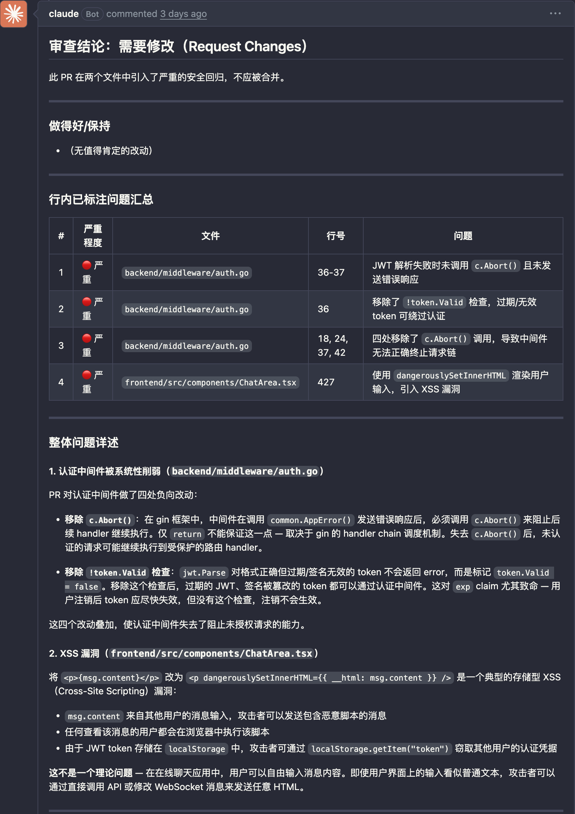

## 前言

本文介绍如何基于 GitHub Actions 触发 Claude Code Action，对每个 Pull Request 自动进行代码审查，并将审查结果以**行内评论 + 总结评论**的形式直接发布到 PR 页面。

Claude Code Action 除了自动 Review，还支持 CI 失败自动修复代码等场景，更多用法可参考 [官方示例仓库](https://github.com/anthropics/claude-code-action/tree/main/examples)。

## 创建 Workflow

在项目根目录下创建 `.github/workflows` 文件夹（注意是 `workflows`，带 `s`）和配置文件：

```bash
mkdir -p .github/workflows
touch .github/workflows/pr-review.yaml
```

将以下内容填入 `pr-review.yaml`：

```yaml
name: Claude PR Review

on:
  pull_request:
    types: [opened, synchronize]

jobs:
  review:
    # 仅对仓库 Owner 提交的 PR 触发，避免 Token 被外部贡献者滥用
    if: github.event.pull_request.author_association == 'OWNER'
    runs-on: ubuntu-latest
    permissions:
      contents: read
      pull-requests: write
      id-token: write

    steps:
      - name: Checkout repository
        uses: actions/checkout@v4
        with:
          fetch-depth: 1

      - name: Review PR
        uses: anthropics/claude-code-action@v1
        # 通过环境变量覆盖 API 端点，实现对 DeepSeek 等第三方服务的调用
        env:
          ANTHROPIC_BASE_URL: ${{ secrets.ANTHROPIC_BASE_URL }}
          ANTHROPIC_AUTH_TOKEN: ${{ secrets.ANTHROPIC_AUTH_TOKEN }}
          ANTHROPIC_MODEL: ${{ secrets.ANTHROPIC_MODEL }}
          ANTHROPIC_DEFAULT_OPUS_MODEL: ${{ secrets.ANTHROPIC_DEFAULT_OPUS_MODEL }}
          ANTHROPIC_DEFAULT_SONNET_MODEL: ${{ secrets.ANTHROPIC_DEFAULT_SONNET_MODEL }}
          ANTHROPIC_DEFAULT_HAIKU_MODEL: ${{ secrets.ANTHROPIC_DEFAULT_HAIKU_MODEL }}
          CLAUDE_CODE_SUBAGENT_MODEL: ${{ secrets.CLAUDE_CODE_SUBAGENT_MODEL }}
          CLAUDE_CODE_EFFORT_LEVEL: ${{ secrets.CLAUDE_CODE_EFFORT_LEVEL }}
        with:
          anthropic_api_key: ${{ secrets.ANTHROPIC_API_KEY }}
          prompt: |
            仓库: ${{ github.repository }}
            PR 编号: ${{ github.event.pull_request.number }}

            请对这个 Pull Request 进行一次彻底的代码审查。

            说明: PR 分支已检出到当前工作目录，可直接读取文件。

            请重点关注以下方面：
            - 是否遵循项目编码规范（参见 CLAUDE.md）
            - 错误处理是否得当
            - 安全最佳实践
            - 测试覆盖情况
            - 文档是否完善

            ## 语言要求（必须遵守）

            所有发布到 GitHub 的审查内容（包括每一条行内评论和最终总结评论）都必须使用简体中文。
            代码标识符、文件路径、命令名、引用的代码片段等保持原文形式，不需要翻译。

            ## 如何发布审查结果（必须执行）

            你必须将审查结果发回 GitHub，否则审查结果不可见。请同时使用以下两种方式：

            1. 对每一个具体的代码问题，调用
               `mcp__github_inline_comment__create_inline_comment`，
               在对应文件和行号处发表评论，每条聚焦一个问题并给出修复建议。

            2. 所有行内评论发完后，通过以下命令发布整体总结评论：

               gh pr comment ${{ github.event.pull_request.number }} \
                 --repo ${{ github.repository }} \
                 --body-file - <<'REVIEW_EOF'
               <你的完整 Markdown 总结，使用中文>
               REVIEW_EOF

               总结应包含：简短结论（批准 / 需要修改 / 仅评论）、值得肯定的地方、
               行内问题汇总清单、没有具体行号的整体性问题（架构、测试、文档等）。

            若没有发现任何问题，仍需发一条总结评论明确说明。
          claude_args: |
            --allowedTools "mcp__github_inline_comment__create_inline_comment,Bash(gh pr comment:*),Bash(gh pr diff:*),Bash(gh pr view:*),Read,Grep,Glob"
```

## 配置 Secrets

打开 GitHub 仓库，进入 **Settings → Secrets and variables → Actions**，添加以下密钥。

**必填项：**

| Secret | 说明 |
|---|---|
| `ANTHROPIC_BASE_URL` | 第三方 API 的 Base URL |
| `ANTHROPIC_API_KEY` | 第三方 API Key |
| `ANTHROPIC_AUTH_TOKEN` | 与 `ANTHROPIC_API_KEY` 相同即可 |

**可选项（当 API 提供商没有模型映射时填写）：**

| Secret | 说明 |
|---|---|
| `ANTHROPIC_MODEL` | 默认模型 |
| `ANTHROPIC_DEFAULT_OPUS_MODEL` | 替代 Opus 的模型 |
| `ANTHROPIC_DEFAULT_SONNET_MODEL` | 替代 Sonnet 的模型 |
| `ANTHROPIC_DEFAULT_HAIKU_MODEL` | 替代 Haiku 的模型 |
| `CLAUDE_CODE_SUBAGENT_MODEL` | 子 Agent 使用的模型 |
| `CLAUDE_CODE_EFFORT_LEVEL` | 推理强度（`low` / `medium` / `high` / `max`） |

以 DeepSeek 为例，具体的 Secret 值可参考 [DeepSeek 接入 Claude Code 文档](https://api-docs.deepseek.com/zh-cn/quick_start/agent_integrations/claude_code)。



## 注意事项

通过 PR 合并 `pr-review.yaml` 时，该 PR 本身会立即触发一次 Review，但由于 MCP 工具尚未就绪，这次 Review **预期会失败**，属于正常现象。建议单独创建一个测试 PR 来验证配置是否生效。

## 效果展示

以下为一次真实 Review 的效果，具体结果可参考 [测试 PR](https://github.com/FearfulTomcat27/wetalk/pull/15)。Claude Code 会生成多条行内评论，并在最后发布一条汇总评论。






